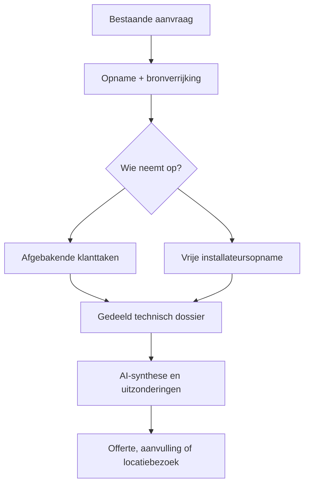

# Architectuurkeuzes

> **Documentversie:** 2.0 · **Laatste update:** 2026-07-30 · Onderhoud: zie [AGENTS.md](../AGENTS.md)

Status: de runtime hieronder is **geïmplementeerd**; de dossier- en airco-doelarchitectuur is **besloten maar nog niet volledig gebouwd**. Zie [product-model.md](product-model.md) en ADR-0011/0012.

## Uitgangspunt: dossierkern met herbruikbare invoerkanalen

De applicatie blijft één Laravel-codebase. De centrale architectuurgrens is de technische **opname**, niet de klantvragenlijst:

- `Intake` blijft het bestaande migratieanker voor opname, lifecycle, bijdragers, taken, bewijs en beslisgereedheid.
- De template-engine blijft generiek voor vragen, foto-/documentopdrachten, regels, autosave en taakcompleetheid.
- Airco krijgt binnen dezelfde codebase een eigen domeinlaag voor ruimtes, plaatsingsopties, installatieopties en koel-, condens- en stroomverbindingen.
- AI, openbare bronnen, klant en installateur schrijven geen parallel dossier; hun bijdragen worden aan dezelfde opnameobjecten gekoppeld.

Nieuwe intaketypes kunnen de generieke dossier- en takenbouwstenen hergebruiken en eigen domeinobjecten toevoegen wanneer alleen templateconfiguratie technisch onvoldoende is. Dit vervangt de oude aanname “airco is uitsluitend configuratie”, maar creëert geen aparte airco-app.

## Huidige runtime-stack (feitelijk)

| Laag | Versie / keuze |
|------|----------------|
| PHP | `^8.3` (composer); staging CI/server **8.4**; lokaal gemeten 8.5.7 |
| Laravel | **13.20.0** (`^13.8`) |
| Auth | Laravel Breeze (Blade), session guard |
| UI | Blade + Alpine.js; **Livewire 4.3** (klantwizard) |
| CSS/JS | Tailwind 3.4 + Vite 8 |
| DB | MySQL (env); sqlite in-memory in tests |
| Queue/cache/session | `database` |
| Tests | Pest 4 |
| Kwaliteit | Pint + PHPStan/Larastan level 6 |

## Domeinstructuur: `app/Domains/*`

Namespaces binnen één Laravel-app (`App\Domains\Intake\...`), geen aparte packages.

Per domein:

- **Actions** — één use-case (`CreateIntake`, `SaveIntakeAnswer`, `CompleteIntake`, …)
- **Services** — herbruikbare domeinlogica (`CompletenessChecker`, `VisibilityResolver`, …)
- **Models** — Eloquent binnen het domein

`app/Http` blijft dun (controllers, form requests, middleware, Livewire als UI-adapter). `app/Support` voor domeinloze helpers.

Actieve domeinen: `Intake`, `AI` en `Branding`. Doelarchitectuur: voeg `Airco` toe zodra BL-039 de eerste persistente plaatsings-/installatieobjecten bouwt. Tot dat moment mag documentatie die namespace niet als geïmplementeerd presenteren.

## Huidige request- en datastromen

```text
Installateur (session auth)
  → Dashboard / CreateIntake / Review
  → leest intakes + generated_reports + private uploads (policy)

Klant (access_token middleware)
  → stappen-UI → SaveIntakeAnswer / StoreIntakeUpload
  → CompletenessChecker bij navigatie/afronden
  → CompleteIntake → snapshot + HTML-rapport

Templatebeheer (seed/artisan)
  → published intake_template_versions (immutabel)

Adresverrijking (synchronisch, fail-soft)
  → PDOK/Kadaster BAG → adres- en pandfeiten
  → EP-Online heeft prioriteit voor geregistreerd woningtype
  → BAG-pandcontext → deterministische woningtypeafleiding bij hoge zekerheid
  → intake_external_facts + gemarkeerde prefill; bij twijfel blijft de vraag staan

Dossierafronding / afgeronde aanvullende ronde
  → SuggestAttentionPointsJob automatisch
  → IntakeAttentionContextBuilder bundelt technische dossierbronnen + provenance
  → AI-voorstellen blijven proposed tot accept/dismiss door installateur
  → providerfout blokkeert dossier, review en rapport nooit
```

De huidige klantlink en templatewizard zijn een werkende invoerflow. De routebackend uit BL-029 bestaat, maar de oorspronkelijke generieke klant-/goedkeurings-UI wordt niet meer gebouwd volgens ADR-0009; ADR-0012 herijkt deze bouwsteen.

## Doelstroom



De bijdrager staat los van het technische object:

- een foto kan door klant of installateur worden gemaakt;
- een waarneming kan uit aanvraag, register, beeld, installateur of AI komen;
- een taak kan vóór of na een eerste beoordeling aan klant of installateur worden toegewezen;
- een klanttoken wordt pas aangemaakt/geactiveerd wanneer werkelijk klanttaken bestaan;
- beslisgereedheid wordt per domeingebied berekend, niet uit één wizardpercentage.

Stapsgewijze migratie:

1. nieuwe dossierobjecten naast `intake_answers`, `intake_external_facts`, `intake_uploads` en `pipe_route_*`;
2. expliciete bewijslinks vanuit bestaande records;
3. nieuwe klant-/installateursworkflows boven dezelfde acties;
4. rapport, review en metrics omschakelen op beslisgereedheid;
5. pas daarna verouderde impliciete vraagkoppelingen uitfaseren.

## Frontend

Server-rendered Blade. Livewire voor interactieve stappen, camera/uploads en installateurswerkweergave. Alpine voor kleine client-gedragingen. Geen Inertia/SPA.

Bestaande Breeze-componenten vormen één solide, tenantgestuurd designsysteem: systeemtypografie, neutrale oppervlakken en CSS-variabelen uit `Company::themeTokens()`. Geen Liquid Glass, blur of translucency (ADR-0010).

Doel-UX:

- **klant:** mobiel, lineair, één veilige opdracht tegelijk, uitsluitend toegewezen taken;
- **installateur:** mobiel/camera-first, vrije volgorde, direct technische objecten en conclusies bewerken;
- **review:** installatievoorstel en gemarkeerde uitzonderingen beoordelen, geen veld-voor-veld-akkoordadministratie.

## Queues

`QUEUE_CONNECTION=database` blijft. Kernintake is **synchronisch** (ADR-0004). AI-samenvatting en PDF-export (BL-005, Dompdf) lopen as jobs. cPanel-cron worker: zie `docs/DEPLOYMENT.md`.

## Storage

Media via `config('filesystems.media')` → env `MEDIA_DISK`. Default **private `local`**, niet `public` (ADR-0003). S3 = env-wissel. Details: `docs/uploads.md`.

## Autorisatie

- Installateur: `auth` + policies; iedere query en mutatie is begrensd door `company_id`.
- Klant: token-middleware, scope = één intake; bedrijf en branding worden uitsluitend via die intake geladen.
- `companies` is de tenantbron (ADR-0010, vervangt ADR-0006).

### Tenantinvarianten voor implementerende agents

1. Een installateursservice die tenantdata leest, ontvangt een verplichte `Company`; `null` mag nooit “alle bedrijven” betekenen.
2. Route-modelbinding is geen autorisatie. Gebruik een policy of een autoriserende FormRequest vóór iedere mutatie of private download.
3. Customer-routes gebruiken alleen het door `EnsureCustomerIntakeAccess` geplaatste `customer_intake`; zoek geen bedrijf op uit een los requestveld.
4. Private mediapaden worden nooit direct gepubliceerd. Logo's en intakebestanden lopen via geautoriseerde/tokengebonden controllers.
5. Nieuwe tenantgebonden paden krijgen minimaal een positieve test voor een collega binnen hetzelfde bedrijf en een negatieve cross-company test.

## AI

Geïmplementeerd: samenvatting, aandachtspunten, tekst-/foto-afleiding, modeltiering voor routeanalyse, budgetguard en provenance; externe calls blijven gated en soft-fail (ADR-0005/0009, `docs/ai.md`).

Doel: AI ordent bewijs, stelt plaatsingen/installatieopties en drie verbindingen voor, kiest de kleinste beslissende vervolgopdracht en markeert conflicten. Sterke afleidingen worden zonder losse bevestigingsstap toegepast; de installateur beslist over het voorstel als geheel. AI bepaalt nooit zelfstandig elektrische veiligheid, definitieve uitvoerbaarheid of offertegoedkeuring (ADR-0011/0012).

## Testen

Pest. CI: Pint + PHPStan + Pest. Domeinregels krijgen feature tests per fase.

## Deployment

Build in GitHub Actions, rsync release, `deploy/activate.sh` (migrate, cache, atomic symlink). Details: `docs/DEPLOYMENT.md`.

## Codekwaliteit

- Pint (laravel + `declare_strict_types`)
- PHPStan level 6 (Larastan)
- CI blokkeert merges op PR

## Trade-offs

1. **Stapsgewijze dossiermigratie** — tijdelijk bestaan huidige vraagkoppelingen en nieuwe dossierobjecten naast elkaar; duurder dan een big-bang rewrite, maar bestaande intakes, templateversies en productieflows blijven bruikbaar.
2. **cPanel** — cron-queue i.p.v. Supervisor; gedeelde PHP-limieten (uploads! zie BL-003 in `docs/backlog.md`).
3. **Token plaintext in DB** — hertoonbare link vs. hash-only (ADR-0002); een token is in het doelmodel optioneel en taakgebonden.
4. **Expliciete companies-tabel** — iets meer query- en testdiscipline, maar een harde grens voor data, media en branding (ADR-0010).
5. **HTML-rapport eerst** — PDF is een afgeleid async artefact (BL-005 done; Dompdf).

## Gerelateerde documentatie

- `docs/product-model.md` — product-, workflow- en airco-doelmodel
- `docs/database.md` — schema + ER
- `docs/intake-engine.md` — templates/opdrachten/regels/taakcompleetheid
- `docs/uploads.md` — media
- `docs/ai.md` — AI-roadmap
- `docs/implementation-plan.md` — fasering
- `docs/decisions/` — ADRs
