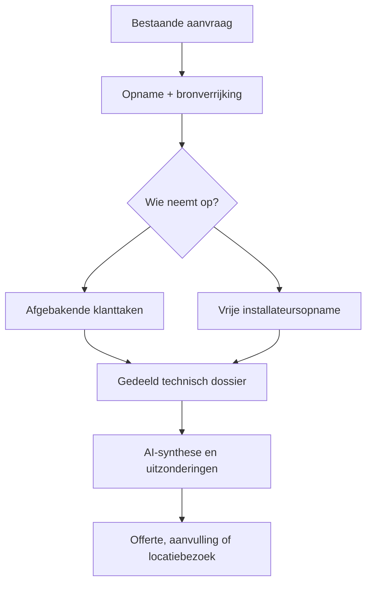

# Architectuurkeuzes

> **Documentversie:** 2.1 · **Laatste update:** 2026-07-30 · Onderhoud: zie [AGENTS.md](../AGENTS.md)

Status: de runtime, dossierkern en eerste airco-domeinlaag hieronder zijn **geïmplementeerd**. Zie [product-model.md](product-model.md) en ADR-0011/0012.

## Uitgangspunt: dossierkern met herbruikbare invoerkanalen

De applicatie blijft één Laravel-codebase. De centrale architectuurgrens is de technische **opname**, niet de klantvragenlijst:

- `Intake` blijft het bestaande migratieanker voor opname, lifecycle, bijdragers, taken, bewijs en beslisgereedheid.
- De template-engine blijft generiek voor vragen, foto-/documentopdrachten, regels, autosave en taakcompleetheid.
- Airco heeft binnen dezelfde codebase persistente modellen en services voor ruimtes, plaatsingsopties, installatieopties en koel-, condens- en stroomverbindingen.
- AI, openbare bronnen, klant en installateur schrijven geen parallel dossier; hun bijdragen worden aan dezelfde opnameobjecten gekoppeld.

Nieuwe intaketypes kunnen de generieke dossier- en takenbouwstenen hergebruiken en eigen domeinobjecten toevoegen wanneer alleen templateconfiguratie technisch onvoldoende is. Dit vervangt de oude aanname “airco is uitsluitend configuratie”, maar creëert geen aparte airco-app.

## Huidige runtime-stack (feitelijk)

| Laag | Versie / keuze |
|------|----------------|
| PHP | `^8.3` (composer); staging CI/server **8.4**; lokaal gemeten 8.5.7 |
| Laravel | **13.20.0** (`^13.8`) |
| Auth | Laravel Breeze (Blade), session guard |
| UI | Blade + Alpine.js; **Livewire 4.3** (klantwizard) |
| CSS/JS | Tailwind 3.4 + Vite 8 |
| DB | MySQL (env); sqlite in-memory in tests |
| Queue/cache/session | `database` |
| Tests | Pest 4 |
| Kwaliteit | Pint + PHPStan/Larastan level 6 |

## Domeinstructuur: `app/Domains/*`

Namespaces binnen één Laravel-app (`App\Domains\Intake\...`), geen aparte packages.

Per domein:

- **Actions** — één use-case (`CreateIntake`, `SaveIntakeAnswer`, `CompleteIntake`, …)
- **Services** — herbruikbare domeinlogica (`CompletenessChecker`, `VisibilityResolver`, …)
- **Models** — Eloquent binnen het domein

`app/Http` blijft dun (controllers, form requests, middleware, Livewire als UI-adapter). `app/Support` voor domeinloze helpers.

Actieve namespaces: `Intake`, `AI` en `Branding`. De eerste airco-objecten staan bewust onder `App\Domains\Intake`, omdat zij lifecycle, tenancy, bewijs en beslisgereedheid delen met de opname. Een aparte `Airco`-namespace is pas zinvol wanneer het domein groot genoeg wordt; de huidige code claimt die grens niet.

## Huidige request- en datastromen

```text
Installateur (session auth)
  → Dashboard / Nieuwe opname / technische werkplek / Review
  → kiest customer of installer workflow
  → leest en muteert dossier, airco-opties, verbindingen en private media (policy)

Klant (access_token middleware)
  → volledige begeleide taakset óf alleen open gerichte bijdrage-items
  → SaveIntakeAnswer / StoreIntakeUpload / CompleteFollowUpRound
  → CompletenessChecker bewaakt uitsluitend de actieve taakset
  → klanttoegang gaat na een gerichte bijdrage weer uit

Templatebeheer (seed/artisan)
  → published intake_template_versions (immutabel)

Adresverrijking (synchronisch, fail-soft)
  → PDOK/Kadaster BAG → adres- en pandfeiten
  → EP-Online heeft prioriteit voor geregistreerd woningtype
  → BAG-pandcontext → deterministische woningtypeafleiding bij hoge zekerheid
  → intake_external_facts + gemarkeerde prefill; bij twijfel blijft de vraag staan

Dossierafronding / afgeronde aanvullende ronde
  → DossierManager synchroniseert legacy-antwoorden, bronnen en bewijs
  → DecisionReadinessService berekent acht technische beslisgebieden
  → SynthesizeSurveyDossierJob bundelt geschoonde broncontext + relevante analysekopieën
  → AI-plaatsingen, installatieoptie, verbindingen, uitzonderingen en taken blijven voorstellen
  → providerfout blokkeert dossier, review en rapport nooit
```

De klantlink en templatewizard blijven een invoerflow. De routebackend uit BL-029 is via een unieke `airco_connection_id` per concrete verbinding hergebruikt; de oorspronkelijke globale route-UI is vervallen volgens ADR-0012.

## Centrale stroom



De bijdrager staat los van het technische object:

- een foto kan door klant of installateur worden gemaakt;
- een waarneming kan uit aanvraag, register, beeld, installateur of AI komen;
- een taak kan vóór of na een eerste beoordeling aan klant of installateur worden toegewezen;
- een intern tokenanker bestaat voor iedere opname, maar toegang wordt alleen geactiveerd wanneer werkelijk klanttaken bestaan en de link wordt alleen dan verzonden;
- beslisgereedheid wordt per domeingebied berekend, niet uit één wizardpercentage.

De geïmplementeerde migratiebrug:

1. maakt dossieronderwerpen, records, bewijslinks, bijdrageopdrachten en beslisgebieden naast de bestaande records;
2. backfillt voor bestaande opnames een dossierroot en bewijslinks zonder gepinde templates te wijzigen;
3. houdt legacy-antwoorden, externe feiten, uploads en vervolgronden daarna idempotent met het dossier gesynchroniseerd;
4. laat de nieuwe werkplek en AI op het dossier werken terwijl rapport/PDF en de historische review bruikbaar blijven;
5. maakt uitfaseren van impliciete vraagkoppelingen later mogelijk zonder dat deze PR productiehistorie herschrijft.

## Frontend

Server-rendered Blade. Livewire voor de interactieve klantwizard en klantuploads; de installateurswerkplek gebruikt snelle Blade-formulieren en mobiele file-inputs. Alpine voor kleine client-gedragingen. Geen Inertia/SPA.

Bestaande Breeze-componenten vormen één solide, tenantgestuurd designsysteem: systeemtypografie, neutrale oppervlakken en CSS-variabelen uit `Company::themeTokens()`. Geen Liquid Glass, blur of translucency (ADR-0010).

Doel-UX:

- **klant:** mobiel, lineair, één veilige opdracht tegelijk; de initiële begeleide taakset of uitsluitend toegewezen gerichte taken;
- **installateur:** mobiel/camera-first, vrije volgorde, direct technische objecten en conclusies bewerken;
- **review:** installatievoorstel en gemarkeerde uitzonderingen beoordelen, geen veld-voor-veld-akkoordadministratie.

## Queues

`QUEUE_CONNECTION=database` blijft. Kernintake is **synchronisch** (ADR-0004). AI-samenvatting, dossiersynthese en PDF-export (BL-005, Dompdf) lopen als jobs. cPanel-cron worker: zie `docs/DEPLOYMENT.md`.

## Storage

Media via `config('filesystems.media')` → env `MEDIA_DISK`. Default **private `local`**, niet `public` (ADR-0003). Iedere foto wordt vóór opslag genormaliseerd naar een metadata-vrije dossier-JPEG en een kleinere analyse-JPEG; vision-acties mogen alleen de analysekopie lezen. S3 = env-wissel. Details: `docs/uploads.md`.

## Autorisatie

- Installateur: `auth` + policies; iedere query en mutatie is begrensd door `company_id`.
- Klant: token-middleware, scope = één intake; bedrijf en branding worden uitsluitend via die intake geladen.
- `companies` is de tenantbron (ADR-0010, vervangt ADR-0006).

### Tenantinvarianten voor implementerende agents

1. Een installateursservice die tenantdata leest, ontvangt een verplichte `Company`; `null` mag nooit “alle bedrijven” betekenen.
2. Route-modelbinding is geen autorisatie. Gebruik een policy of een autoriserende FormRequest vóór iedere mutatie of private download.
3. Customer-routes gebruiken alleen het door `EnsureCustomerIntakeAccess` geplaatste `customer_intake`; zoek geen bedrijf op uit een los requestveld.
4. Private mediapaden worden nooit direct gepubliceerd. Logo's en intakebestanden lopen via geautoriseerde/tokengebonden controllers.
5. Nieuwe tenantgebonden paden krijgen minimaal een positieve test voor een collega binnen hetzelfde bedrijf en een negatieve cross-company test.

## AI

Geïmplementeerd: samenvatting, aandachtspunten, tekst-/foto-afleiding, modeltiering voor routeanalyse, budgetguard, provenance en dossiersynthese. De dossiersynthese ordent geschoond bewijs, stelt gegronde plaatsingen, één installatieoptie en drie verbindingstypen voor, kiest de kleinste beslissende vervolgopdracht en markeert conflicten. Alle beeldpaden gebruiken de analysevariant; externe calls blijven gated en soft-fail (ADR-0005/0009, `docs/ai.md`).

Sterke deterministische afleidingen worden volgens expliciete serverregels zonder losse bevestigingsstap toegepast; AI-dossierobjecten blijven voorstelbaar en corrigeerbaar. De installateur beslist over het geheel. AI bepaalt nooit zelfstandig elektrische veiligheid, definitieve uitvoerbaarheid of offertegoedkeuring (ADR-0011/0012).

## Testen

Pest. CI: Pint + PHPStan + Pest. Domeinregels krijgen feature tests per fase.

## Deployment

Build in GitHub Actions, rsync release, `deploy/activate.sh` (migrate, cache, atomic symlink). Details: `docs/DEPLOYMENT.md`.

## Codekwaliteit

- Pint (laravel + `declare_strict_types`)
- PHPStan level 6 (Larastan)
- CI blokkeert merges op PR

## Trade-offs

1. **Stapsgewijze dossiermigratie** — tijdelijk bestaan huidige vraagkoppelingen en nieuwe dossierobjecten naast elkaar; duurder dan een big-bang rewrite, maar bestaande intakes, templateversies en productieflows blijven bruikbaar.
2. **cPanel** — cron-queue i.p.v. Supervisor; gedeelde PHP-limieten (uploads! zie BL-003 in `docs/backlog.md`).
3. **Token plaintext in DB** — hertoonbare link vs. hash-only (ADR-0002); installer-only-opnames bewaren een intern tokenanker maar de middleware weigert toegang zolang `customer_access_enabled=false`.
4. **Expliciete companies-tabel** — iets meer query- en testdiscipline, maar een harde grens voor data, media en branding (ADR-0010).
5. **HTML-rapport eerst** — PDF is een afgeleid async artefact (BL-005 done; Dompdf).

## Gerelateerde documentatie

- `docs/product-model.md` — product-, workflow- en aircomodel
- `docs/database.md` — schema + ER
- `docs/intake-engine.md` — templates/opdrachten/regels/taakcompleetheid
- `docs/uploads.md` — media
- `docs/ai.md` — AI-roadmap
- `docs/implementation-plan.md` — fasering
- `docs/decisions/` — ADRs
