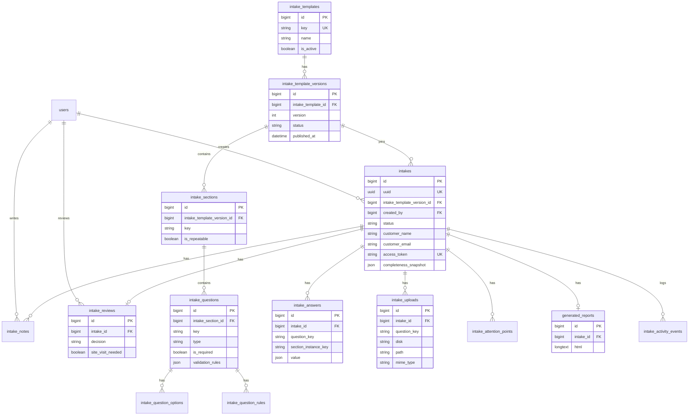

# Databaseschema — Digitale Opname

Status: **geïmplementeerd (Fase 2 migraties)**. Bestaande Laravel-tabellen plus intake-engine-schema via `2026_07_17_120000_create_intake_engine_tables`.

## Ontwerpprincipes

1. **Template ≠ uitvoering.** Definities (templateversies, secties, vragen) zijn los van antwoorden van een concrete opname.
2. **Immutabele gepubliceerde versies.** Een intake pin’t een `intake_template_version_id`. Afronden wijzigt die versie nooit.
3. **Geen multi-company in MVP.** Eén installatiebedrijf per installatie. Geen `companies`-tabel tot multi-tenancy echt nodig is.
4. **Privacy.** Persoonsgegevens en foto’s zitten in `intakes`, `intake_answers`, `intake_uploads`. Soft delete + expliciete purge-actie voor dossierverwijdering.
5. **JSON alleen waar zinvol.** Antwoordwaarden, validatieregels, compleetheidsnapshots. Geen volledige template-JSON als primaire bron — relationeel blijft leidend.

## Enums (PHP backed enums, centrale bron)

| Enum | Waarden |
|------|---------|
| `IntakeStatus` | `draft`, `sent`, `in_progress`, `completed`, `reviewed`, `cancelled` |
| `QuestionType` | `short_text`, `long_text`, `number`, `single_choice`, `multi_choice`, `boolean`, `photo` |
| `TemplateVersionStatus` | `draft`, `published`, `archived` |
| `ReviewDecision` | `pending`, `prepare_quote`, `need_more_info`, `site_visit_needed`, `not_suitable` |
| `AttentionPointSource` | `system`, `reviewer` |
| `RuleOperator` | `equals`, `not_equals`, `in`, `not_in`, `gt`, `gte`, `lt`, `lte`, `filled` |
| `RuleEffect` | `show`, `require` |

NL-labels (concept / verstuurd / …) horen in UI/resources, niet als DB-waarden.

## Tabellen

### `users` (bestaand)

Installateuraccounts. Geen rollenstructuur in MVP.

Privacy: `name`, `email`, `password` (hashed).

### `intake_templates`

Stabiele intaketypes (bijv. airco).

| Kolom | Type | Toelichting |
|-------|------|-------------|
| `id` | bigint PK | |
| `key` | string unique | Machinekey, bv. `airco` |
| `name` | string | Weergavenaam |
| `description` | text nullable | |
| `is_active` | boolean | Of nieuwe opnames dit type mogen kiezen |
| `timestamps` | | |

**Waarom:** scheidt het productconcept “Airco-opname” van concrete versies van de vragenlijst.

### `intake_template_versions`

Gepubliceerde of conceptversies van een template.

| Kolom | Type | Toelichting |
|-------|------|-------------|
| `id` | bigint PK | |
| `intake_template_id` | FK → templates, cascade | |
| `version` | unsigned int | Monotoon per template |
| `status` | string/enum | `draft` / `published` / `archived` |
| `published_at` | timestamp nullable | |
| `change_notes` | text nullable | Interne toelichting |
| `timestamps` | | |

Unique: `(intake_template_id, version)`.  
Index: `(intake_template_id, status)`.

**Regel:** na `published` mag de versie-inhoud (secties/vragen/opties/regels) niet meer wijzigen. Wijzigingen = nieuwe versie.

### `intake_sections`

| Kolom | Type | Toelichting |
|-------|------|-------------|
| `id` | bigint PK | |
| `intake_template_version_id` | FK, cascade | |
| `key` | string | Stabiel binnen versie, bv. `rooms` |
| `title` | string | |
| `description` | text nullable | |
| `sort_order` | unsigned int | |
| `is_repeatable` | boolean | Bijv. per binnenunit |
| `repeat_count_question_key` | string nullable | Vraag die het aantal herhalingen bepaalt |
| `timestamps` | | |

Unique: `(intake_template_version_id, key)`.

### `intake_questions`

| Kolom | Type | Toelichting |
|-------|------|-------------|
| `id` | bigint PK | |
| `intake_section_id` | FK, cascade | |
| `key` | string | Stabiel binnen versie |
| `type` | QuestionType | |
| `label` | string | |
| `help_text` | text nullable | |
| `photo_instructions` | text nullable | Alleen relevant bij `photo` |
| `is_required` | boolean | Basisverplichting (conditioneel via rules) |
| `sort_order` | unsigned int | |
| `validation_rules` | json nullable | Laravel-achtige regels / limieten |
| `meta` | json nullable | min/max, accept, max_files, … |
| `timestamps` | | |

Unique: `(intake_section_id, key)`.  
Index: `(intake_section_id, sort_order)`.

### `intake_question_options`

Keuze-opties voor single/multi choice.

| Kolom | Type |
|-------|------|
| `id` | bigint PK |
| `intake_question_id` | FK, cascade |
| `value` | string |
| `label` | string |
| `sort_order` | unsigned int |

Unique: `(intake_question_id, value)`.

### `intake_question_rules`

Conditionele zichtbaarheid / verplichting.

| Kolom | Type | Toelichting |
|-------|------|-------------|
| `id` | bigint PK | |
| `intake_question_id` | FK target, cascade | Vraag die beïnvloed wordt |
| `source_question_key` | string | Bronvraag (zelfde versie) |
| `operator` | RuleOperator | |
| `value` | json | Vergelijkingswaarde(n) |
| `effect` | RuleEffect | `show` of `require` |

Index: `(intake_question_id)`.

### `intakes`

Eén digitale opname / klanttraject.

| Kolom | Type | Toelichting |
|-------|------|-------------|
| `id` | bigint PK | |
| `uuid` | uuid unique | Stabiele interne referentie |
| `intake_template_version_id` | FK, restrict | Gepinde versie |
| `created_by` | FK → users, restrict | Installateur |
| `status` | IntakeStatus | |
| `customer_name` | string | Privacy |
| `customer_email` | string | Privacy |
| `customer_phone` | string nullable | Privacy |
| `address_line` | string | Privacy |
| `address_postal_code` | string nullable | Privacy |
| `address_city` | string nullable | Privacy |
| `access_token` | string(64) unique | Klantbearer-token (zie ADR-0002) |
| `token_expires_at` | timestamp nullable | |
| `token_revoked_at` | timestamp nullable | |
| `internal_note` | text nullable | Alleen intern |
| `current_section_key` | string nullable | Voortgang-UX |
| `progress_percent` | unsigned tinyint default 0 | Gecached |
| `started_at` | timestamp nullable | Eerste klantactiviteit |
| `completed_at` | timestamp nullable | |
| `reviewed_at` | timestamp nullable | |
| `completeness_snapshot` | json nullable | Momentopname bij afronding |
| `timestamps` | | |
| `deleted_at` | soft delete | |

Indexes: `status`, `created_by`, `customer_email`, `(status, created_at)`.

**Tokenstrategie:** zie ADR-0002. Token zit in URL en DB (hoge entropie); nooit in logs.

### `intake_answers`

| Kolom | Type | Toelichting |
|-------|------|-------------|
| `id` | bigint PK | |
| `intake_id` | FK, cascade | |
| `question_key` | string | Verwijst naar key in gepinde versie |
| `section_instance_key` | string nullable | Bij repeatables: `room-1` |
| `value` | json | Genormaliseerde waarde |
| `answered_at` | timestamp | |

Unique: `(intake_id, question_key, section_instance_key)`.  
Index: `(intake_id)`.

**Bewust niet genormaliseerd naar `question_id`:** keys blijven leesbaar in snapshots/rapporten; de versie is al gepind.

### `intake_uploads`

| Kolom | Type | Toelichting |
|-------|------|-------------|
| `id` | bigint PK | |
| `intake_id` | FK, cascade | |
| `question_key` | string | |
| `section_instance_key` | string nullable | |
| `disk` | string | Waarde van `MEDIA_DISK` bij upload |
| `path` | string | Pad op disk (niet publiek voorspelbaar) |
| `original_filename` | string | Alleen weergave |
| `mime_type` | string | Server-side gecontroleerd |
| `size_bytes` | unsigned bigint | |
| `checksum` | string nullable | Optioneel SHA-256 |
| `sort_order` | unsigned int | |
| `timestamps` | | |
| `deleted_at` | soft delete | |

Index: `(intake_id, question_key)`.

Bestanden: privé disk, pad `intakes/{uuid}/…/{ulid}.ext`. Geen publieke URL.

### `intake_attention_points`

| Kolom | Type |
|-------|------|
| `id` | bigint PK |
| `intake_id` | FK, cascade |
| `source` | AttentionPointSource |
| `code` | string nullable |
| `label` | string |
| `is_resolved` | boolean |
| `resolved_at` | timestamp nullable |
| `resolved_by` | FK users nullable |
| `timestamps` | |

### `intake_notes`

Interne notities van de installateur.

| Kolom | Type |
|-------|------|
| `id` | bigint PK |
| `intake_id` | FK, cascade |
| `user_id` | FK users, restrict |
| `body` | text |
| `timestamps` | |

### `intake_reviews`

Beoordeling na afronding (één actuele review per intake in MVP).

| Kolom | Type |
|-------|------|
| `id` | bigint PK |
| `intake_id` | FK unique, cascade |
| `reviewer_id` | FK users, restrict |
| `decision` | ReviewDecision |
| `site_visit_needed` | boolean |
| `enough_information` | boolean |
| `summary` | text nullable |
| `reviewed_at` | timestamp nullable |
| `timestamps` | |

### `generated_reports`

| Kolom | Type | Toelichting |
|-------|------|-------------|
| `id` | bigint PK | |
| `intake_id` | FK unique, cascade | |
| `html` | longtext | HTML-rapportmomentopname |
| `meta` | json nullable | Compleetheidssamenvatting e.d. |
| `generated_at` | timestamp | |
| `timestamps` | |

PDF later optioneel als apart pad/kolom; HTML heeft voorrang.

### `intake_activity_events` (lichtgewicht audit)

| Kolom | Type |
|-------|------|
| `id` | bigint PK |
| `intake_id` | FK, cascade |
| `actor_type` | string (`user` / `customer` / `system`) |
| `actor_id` | nullable |
| `event` | string |
| `properties` | json nullable (geen ruwe tokens, geen bestandsbytes) |
| `created_at` | timestamp |

Index: `(intake_id, created_at)`.

### Bewust niet in MVP

| Concept | Reden |
|---------|--------|
| `companies` | Geen multi-tenancy nodig |
| `ai_runs` | AI uitgesteld (ADR-0005); schema volgt in Fase 6 |
| `intake_participants` | Klantgegevens op `intakes` volstaan |
| Volledige event-sourcing | Te zwaar |

## Cascadegedrag

| Ouder | Kind | On delete |
|-------|------|-----------|
| template | versions | cascade |
| version | sections | cascade |
| section | questions | cascade |
| question | options/rules | cascade |
| version | intakes | **restrict** (versie met opnames niet hard verwijderen) |
| intake | answers/uploads/notes/attention/reviews/reports/events | cascade |
| user (created_by) | intakes | **restrict** |

Soft-deleted intakes: bestanden blijven tot purge-job/actie.

## Privacygevoelige velden

| Gegeven | Locatie |
|---------|---------|
| Naam, e-mail, telefoon, adres | `intakes` |
| Vrije tekstantwoorden | `intake_answers.value` |
| Foto’s (EXIF kan locatie bevatten) | `intake_uploads` + storage |
| Interne notities | `intake_notes`, `intakes.internal_note` |
| Rapport-HTML | `generated_reports.html` |

**Bewaartermijn (voorstel, nog te bekrachtigen):** actieve dossiers onbeperkt zolang account bestaat; na soft delete 30 dagen hard purge inclusief storage. Geen echte klantdata in seeders/tests.

## Mermaid ER-diagram

## Seeddata (gepland)

- 1 installateur (`test@example.com` of dedicated seeder-user)
- 1 gepubliceerde airco-templateversie
- 1 open intake (`sent`)
- 1 gedeeltelijk ingevulde intake (`in_progress`)
- 1 afgeronde intake (`completed`) met veilige placeholder-uploads

Herhaalbaar, geen productie-overwrite.
