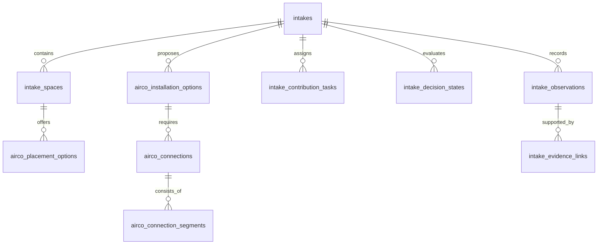
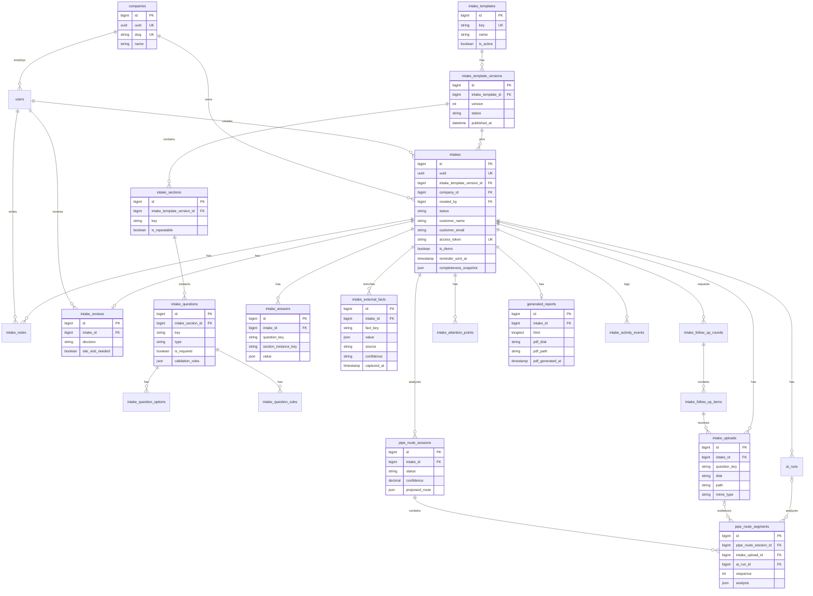

# Databaseschema — Digitale Opname

> **Documentversie:** 2.0 · **Laatste update:** 2026-07-30 · Onderhoud: zie [AGENTS.md](../AGENTS.md)

Status: het hoofdstuk **Huidige tabellen** beschrijft het geïmplementeerde schema. Het hoofdstuk **Besloten doelmodel** is het migratieplan uit ADR-0011/0012 en bestaat nog niet als migrations. Noem doelobjecten niet geïmplementeerd voordat BL-035/039/040 ze daadwerkelijk oplevert.

## Ontwerpprincipes

1. **Template ≠ uitvoering.** Definities (templateversies, secties, vragen) zijn los van antwoorden van een concrete opname.
2. **Immutabele gepubliceerde versies.** Een intake pin’t een `intake_template_version_id`. Afronden wijzigt die versie nooit.
3. **Bedrijf als tenantgrens.** Users, intakes, media en branding zijn via `company_id` geïsoleerd (ADR-0010).
4. **Privacy.** Persoonsgegevens, foto’s en documenten zitten in `intakes`, `intake_answers`, `intake_uploads`. Soft delete + expliciete purge-actie voor dossierverwijdering.
5. **JSON alleen waar zinvol.** Antwoordwaarden, validatieregels, compleetheidsnapshots. Geen volledige template-JSON als primaire bron — relationeel blijft leidend.
6. **Automatische feiten houden hun herkomst.** Externe gegevens staan los van klantantwoorden en bewaren bron, referentie, zekerheid en ophaaltijdstip (ADR-0007).
7. **Doelmodel: dossier vóór vraag.** Nieuwe technische objecten hangen aan de opname; vragen, uploads, externe feiten en AI-runs worden bewijs bij die objecten (ADR-0011).
8. **Stapsgewijze migratie.** Bestaande opnames en gepinde templates blijven werken terwijl nieuwe objecten naast de huidige vraagkoppelingen worden gevuld.

## Enums (PHP backed enums, centrale bron)

| Enum | Waarden |
|------|---------|
| `IntakeStatus` | `draft`, `sent`, `in_progress`, `completed`, `reviewed`, `awaiting_customer`, `cancelled` |
| `QuestionType` | `short_text`, `long_text`, `number`, `single_choice`, `multi_choice`, `boolean`, `photo` |
| `TemplateVersionStatus` | `draft`, `published`, `archived` |
| `ReviewDecision` | `pending`, `prepare_quote`, `need_more_info`, `site_visit_needed`, `not_suitable` |
| `FollowUpItemType` | `text`, `photo`, `document` |
| `FollowUpRoundStatus` | `open`, `completed` |
| `AttentionPointSource` | `system`, `reviewer`, `ai` |
| `RuleOperator` | `equals`, `not_equals`, `in`, `not_in`, `gt`, `gte`, `lt`, `lte`, `filled` |
| `RuleEffect` | `show`, `require` |
| `PipeRouteStatus` | `collecting`, `proposed`, `approved`, `rejected` |
| `AttentionPointStatus` | `proposed`, `accepted`, `dismissed` |
| `PhotoUsabilityVerdict` | `ok`, `too_dark`, `too_small` |

NL-labels (concept / verstuurd / …) horen in UI/resources, niet als DB-waarden.

## Besloten doelmodel (nog niet geïmplementeerd)

De bestaande `intakes`-rij blijft het migratieanker en representeert de technische opname. De voorafgaande aanvraag leeft in het bronsysteem; de opname bewaart een snapshot van de benodigde aanvraaggegevens en waar beschikbaar een externe aanvraagreferentie. Er wordt geen tweede lead-/CRM-flow in deze app gebouwd.

Onderstaande namen zijn werkbare tabelnamen voor de implementatie-ADRs/PR's. Zij zijn pas schemawaarheid nadat de migrations bestaan.

| Doelobject / werknaam | Verantwoordelijkheid | Eerste backlog |
|-----------------------|----------------------|----------------|
| `intake_observations` | Waarneming of conclusie met onderwerp, waarde, bronsoort, actor, zekerheid, status en vaststellingsmoment. | BL-035 |
| `intake_evidence_links` | Koppelt een observatie/conclusie aan bestaand antwoord, extern feit, upload, AI-run of installateurswaarneming zonder de bron te kopiëren. | BL-035 |
| `intake_contribution_tasks` | Afgebakende tekst-, foto-, document-, meet- of controleopdracht voor klant of installateur, met doel/beslisgebied en lifecycle. | BL-035/038 |
| `intake_decision_states` | Status, blokkades en aanbevolen volgende actie per beslisgebied; staat los van vragenlijstcompleetheid. | BL-035/036 |
| `intake_spaces` | Gewenste fysieke ruimtes, onafhankelijk van het gekozen aantal binnenunits. | BL-039 |
| `airco_placement_options` | Kandidaatpositie voor binnenunit, buitenunit, voedingsbron of afvoerpunt, gekoppeld aan ruimte/buitengebied en bewijs. | BL-039 |
| `airco_installation_options` | Eén kandidaatconfiguratie (single-/multi-split of combinatie) met status/rangschikking. | BL-039 |
| `airco_installation_option_placements` | Koppelt de gebruikte binnen-/buiten-/serviceposities aan één installatieoptie. | BL-039 |
| `airco_connections` | Technische verbinding van type `refrigerant`, `condensate` of `power`, met concrete eindpunten, zekerheid en kostenimpact. | BL-040 |
| `airco_connection_segments` | Segmenten, obstakels, lengteklasse, bereikbaarheid en open controles per verbinding. | BL-040 |

### Migratieregels

1. Voeg nieuwe tabellen/kolommen uitbreidend toe; verwijder of herinterpreteer geen historische template-/antwoordrecords.
2. Maak bewijslinks naar bestaande bronrecords. Kopieer foto-, register- of AI-inhoud niet naar een tweede JSON-waarheid.
3. `intakes.access_token` wordt in het doelmodel nullable of verplaatst naar taaktoegang: bij **Zelf uitvoeren** bestaat geen klantlink; maak toegang pas wanneer klanttaken bestaan.
4. `intake_follow_up_rounds/items` blijven tijdens de migratie werken en worden door BL-038 naar algemene bijdrageopdrachten gemapt.
5. `pipe_route_sessions/segments` blijven bestaan en krijgen in BL-040 een expliciete koppeling aan één `airco_connection`; zij zijn niet langer één globale route per opname.
6. Iedere nieuwe tenantgebonden tabel bevat een ondubbelzinnige route naar `company_id` en krijgt positieve same-company- en negatieve cross-company-tests.
7. Een installateurscorrectie verwijdert de eerdere bron-/AI-conclusie niet; zij markeert de geselecteerde conclusie en bewaart de delta voor audit en metrics.

### Doelrelaties

```mermaid
erDiagram
    intakes ||--o{ intake_spaces : contains
    intakes ||--o{ intake_observations : records
    intakes ||--o{ intake_contribution_tasks : assigns
    intakes ||--o{ intake_decision_states : evaluates
    intake_spaces ||--o{ airco_placement_options : offers
    intakes ||--o{ airco_installation_options : proposes
    airco_installation_options ||--o{ airco_connections : requires
    airco_connections ||--o{ airco_connection_segments : consists_of
    intake_observations ||--o{ intake_evidence_links : supported_by
```

## Huidige tabellen (geïmplementeerd)

### `companies`

Tenantbron met UUID/slug, bedrijfsnaam, private logo-metadata en gecontroleerde primaire-, accent- en contrastkleur. Logo's staan op `MEDIA_DISK` onder `companies/{uuid}/branding/`.

### `users` (bestaand)

Installateuraccounts met verplichte FK `company_id`; meerdere users kunnen bij hetzelfde bedrijf horen.

Privacy: `name`, `email`, `password` (hashed).

### `intake_templates`

Stabiele intaketypes (bijv. airco).

| Kolom | Type | Toelichting |
|-------|------|-------------|
| `id` | bigint PK | |
| `key` | string unique | Machinekey, bv. `airco` |
| `name` | string | Weergavenaam |
| `description` | text nullable | |
| `is_active` | boolean | Of nieuwe opnames dit type mogen kiezen |
| `timestamps` | | |

**Waarom:** scheidt het productconcept “Airco-opname” van concrete versies van de vragenlijst.

### `intake_template_versions`

Gepubliceerde of conceptversies van een template.

| Kolom | Type | Toelichting |
|-------|------|-------------|
| `id` | bigint PK | |
| `intake_template_id` | FK → templates, cascade | |
| `version` | unsigned int | Monotoon per template |
| `status` | string/enum | `draft` / `published` / `archived` |
| `published_at` | timestamp nullable | |
| `change_notes` | text nullable | Interne toelichting |
| `timestamps` | | |

Unique: `(intake_template_id, version)`.  
Index: `(intake_template_id, status)`.

**Regel:** na `published` mag de versie-inhoud (secties/vragen/opties/regels) niet meer wijzigen. Wijzigingen = nieuwe versie.

### `intake_sections`

| Kolom | Type | Toelichting |
|-------|------|-------------|
| `id` | bigint PK | |
| `intake_template_version_id` | FK, cascade | |
| `key` | string | Stabiel binnen versie, bv. `rooms` |
| `title` | string | |
| `description` | text nullable | |
| `sort_order` | unsigned int | |
| `is_repeatable` | boolean | Bijv. per binnenunit |
| `repeat_count_question_key` | string nullable | Vraag die het aantal herhalingen bepaalt |
| `timestamps` | | |

Unique: `(intake_template_version_id, key)`.

### `intake_questions`

| Kolom | Type | Toelichting |
|-------|------|-------------|
| `id` | bigint PK | |
| `intake_section_id` | FK, cascade | |
| `key` | string | Stabiel binnen versie |
| `type` | QuestionType | |
| `label` | string | |
| `help_text` | text nullable | |
| `photo_instructions` | text nullable | Alleen relevant bij `photo` |
| `is_required` | boolean | Basisverplichting (conditioneel via rules) |
| `sort_order` | unsigned int | |
| `validation_rules` | json nullable | Laravel-achtige regels / limieten |
| `meta` | json nullable | min/max, accept, max_files, … |
| `timestamps` | | |

Unique: `(intake_section_id, key)`.  
Index: `(intake_section_id, sort_order)`.

### `intake_question_options`

Keuze-opties voor single/multi choice.

| Kolom | Type |
|-------|------|
| `id` | bigint PK |
| `intake_question_id` | FK, cascade |
| `value` | string |
| `label` | string |
| `sort_order` | unsigned int |

Unique: `(intake_question_id, value)`.

### `intake_question_rules`

Conditionele zichtbaarheid / verplichting.

| Kolom | Type | Toelichting |
|-------|------|-------------|
| `id` | bigint PK | |
| `intake_question_id` | FK target, cascade | Vraag die beïnvloed wordt |
| `source_question_key` | string | Bronvraag (zelfde versie) |
| `operator` | RuleOperator | |
| `value` | json | Vergelijkingswaarde(n) |
| `effect` | RuleEffect | `show` of `require` |

Index: `(intake_question_id)`.

### `intakes`

Eén digitale technische opname. In de huidige implementatie bevat deze rij ook de snapshot van klant-/adresgegevens en de klanttoegang; er is geen aparte aanvraagentiteit.

| Kolom | Type | Toelichting |
|-------|------|-------------|
| `id` | bigint PK | |
| `uuid` | uuid unique | Stabiele interne referentie |
| `intake_template_version_id` | FK, restrict | Gepinde versie |
| `company_id` | FK → companies, restrict | Verplichte tenantgrens |
| `created_by` | FK → users, restrict | Installateur |
| `status` | IntakeStatus | |
| `customer_name` | string | Privacy |
| `customer_email` | string | Privacy |
| `customer_phone` | string nullable | Privacy |
| `address_line` | string | Privacy |
| `address_postal_code` | string nullable | Privacy |
| `address_city` | string nullable | Privacy |
| `access_token` | string(64) unique | Klantbearer-token (zie ADR-0002) |
| `token_expires_at` | timestamp nullable | |
| `token_revoked_at` | timestamp nullable | |
| `internal_note` | text nullable | Alleen intern |
| `current_section_key` | string nullable | Wizard-cursor: huidige sectie |
| `current_question_key` | string nullable | Wizard-cursor: huidige vraag (BL-018) |
| `current_section_instance_key` | string nullable | Wizard-cursor: repeatable-instantie (`room-1`, …) |
| `progress_percent` | unsigned tinyint default 0 | Gecached |
| `is_demo` | boolean default false | Tijdelijke publieke demo-opname; index met tokenverval |
| `started_at` | timestamp nullable | Eerste klantactiviteit |
| `completed_at` | timestamp nullable | |
| `reviewed_at` | timestamp nullable | |
| `reminder_sent_at` | timestamp nullable | BL-015: tijdstip van de (max. één) herinneringsmail |
| `completeness_snapshot` | json nullable | Momentopname bij afronding |
| `timestamps` | | |
| `deleted_at` | soft delete | |

Indexes: `status`, `created_by`, `customer_email`, `(status, created_at)`, `(company_id, status, created_at)`, `(is_demo, token_expires_at)`.

**Tokenstrategie:** zie ADR-0002. Token zit in URL en DB (hoge entropie); nooit in logs.

### `intake_answers`

| Kolom | Type | Toelichting |
|-------|------|-------------|
| `id` | bigint PK | |
| `intake_id` | FK, cascade | |
| `question_key` | string | Verwijst naar key in gepinde versie |
| `section_instance_key` | string nullable | Bij repeatables: `room-1` |
| `value` | json | Genormaliseerde waarde |
| `prefill_source` | string nullable | Herkomst van een nog niet door de klant getypt antwoord: `installer` = zichtbare, te bevestigen voorzet (BL-016); `pdok` = eenduidig BAG-feit dat een template expliciet mag overslaan (BL-019). `null` bij een normaal of door de klant bevestigd antwoord. Zie [intake-engine.md § Prefill](intake-engine.md#prefill-van-bekende-gegevens-bl-016). |
| `answered_at` | timestamp | |

Unique: `(intake_id, question_key, section_instance_key)`.  
Index: `(intake_id)`.

**Bewust niet genormaliseerd naar `question_id`:** keys blijven leesbaar in snapshots/rapporten; de versie is al gepind.

### `intake_external_facts`

Automatisch verzamelde feiten blijven gescheiden van klantantwoorden, zodat het dossier altijd laat zien waar een gegeven vandaan komt en wat nog gecontroleerd moet worden (ADR-0007).

| Kolom | Type | Toelichting |
|-------|------|-------------|
| `id` | bigint PK | |
| `intake_id` | FK, cascade | |
| `fact_key` | string | Stabiele machinekey, bv. `building_year` |
| `label` | string | Momentopname van leesbaar label |
| `value` | json | Gestructureerde waarde; mediafeiten bewaren ook `media_disk`/`media_path`/MIME/afmetingen, nooit bestandsbytes |
| `source` | string | Bronlabel, bv. `PDOK / BAG` of `PDOK Luchtfoto RGB` |
| `source_reference` | string nullable | BAG-identificatie of providerreferentie |
| `source_url` | text nullable | Controleerbare bron-URL |
| `confidence` | string | Huidig gebruikt o.a. `high`, `low`, `unknown`; bronservice bepaalt betekenis |
| `captured_at` | timestamp | Tijdstip waarop het feit is opgehaald |
| `timestamps` | | |

Unique: `(intake_id, fact_key, source)`. Index: `(intake_id, confidence)`.

BL-019 bewaart de WMS-luchtfoto als privaat bestand onder `intakes/{uuid}/external/pdok-aerial.jpg`; `aerial_image` bevat alleen opslagmetadata, WMS-laag, bbox en centrumcoördinaten. `HardDeleteIntake` verwijdert media uit externe feiten vóór de cascade-delete.

De BAG-woningtypeafleiding voegt geen schema toe. `building_type_inference` gebruikt dezelfde tabel en bewaart in `value`: templateoptie, leesbare afleidingsreden en aantal verblijfsobjecten. `source_reference` bevat het BAG-pand-ID, `source_url` de controleerbare pandquery en `source` is `PDOK / BAG pandgeometrie`. Het afgeleide antwoord blijft afzonderlijk in `intake_answers` staan met `prefill_source=pdok`.

BL-007 genereert voorstellen automatisch na eerste afronding en opnieuw na een afgeronde aanvullende ronde; er is geen handmatige genereerroute. De integrale AI-payload wordt niet in deze tabel opgeslagen: `ai_runs.input_hash` bewaart alleen de reproduceerbare hash. Voorstellen blijven `source=ai,status=proposed`; accept/dismiss door de installateur blijft de grens tussen voorstel en rapportwaardig aandachtspunt.

### `intake_uploads`

| Kolom | Type | Toelichting |
|-------|------|-------------|
| `id` | bigint PK | |
| `intake_id` | FK, cascade | |
| `question_key` | string | |
| `section_instance_key` | string nullable | |
| `intake_follow_up_item_id` | FK nullable, cascade | BL-027: foto of PDF bij een gerichte vervolgopdracht; `null` voor templatefoto's |
| `disk` | string | Waarde van `MEDIA_DISK` bij upload |
| `path` | string | Pad op disk (niet publiek voorspelbaar) |
| `original_filename` | string | Alleen weergave |
| `mime_type` | string | Server-side gecontroleerd |
| `size_bytes` | unsigned bigint | |
| `checksum` | string nullable | Optioneel SHA-256 |
| `usability_verdict` | string nullable | BL-007: lokale fotokwaliteit-indicatie (`ok`/`too_dark`/`too_small`), `PhotoUsabilityVerdict`. Nooit blokkerend. |
| `sort_order` | unsigned int | |
| `timestamps` | | |
| `deleted_at` | soft delete | |

Index: `(intake_id, question_key)`.

Bestanden: privé disk, pad `intakes/{uuid}/…/{ulid}.ext`. Geen publieke URL.

### `pipe_route_sessions` (BL-029, huidige backend)

Stateful synthese van één begeleide route. ADR-0012 vervangt de oorspronkelijke globale UI-aanname; BL-040 koppelt deze bestaande bouwsteen later aan één concrete aircoverbinding.

| Kolom | Type | Toelichting |
|-------|------|-------------|
| `id` | bigint PK | |
| `intake_id` | FK, cascade | Huidige koppeling aan opname |
| `status` | PipeRouteStatus | `collecting`, `proposed`, `approved`, `rejected` |
| `confidence` | decimal(4,3) nullable | Synthesezekerheid 0..1 |
| `proposed_route` | json nullable | Gestructureerde voorgestelde route |
| `alternative_route` | json nullable | Alternatief |
| `uncertainties` | json nullable | Onzekerheden |
| `missing_checks` | json nullable | Ontbrekende controles |
| `next_photo_instruction` | text nullable | Eén gerichte volgende foto-opdracht |
| `approved_by` | FK users nullable | Installateursbeoordeling |
| `approved_at` | timestamp nullable | |
| `timestamps` | | |

Index: `(intake_id, status)`.

### `pipe_route_segments` (BL-029, huidige backend)

| Kolom | Type | Toelichting |
|-------|------|-------------|
| `id` | bigint PK | |
| `pipe_route_session_id` | FK, cascade | |
| `intake_upload_id` | FK nullable, null on delete | Bewijsfoto |
| `ai_run_id` | FK nullable, null on delete | Bijbehorende analyse |
| `sequence` | unsigned smallint | Volgorde |
| `label` | string nullable | Rol, bv. binnenwand/gevel/obstakel |
| `photo_usable` | boolean nullable | |
| `route_possible` | boolean nullable | |
| `confidence` | decimal(4,3) nullable | 0..1 |
| `analysis` | json nullable | Volledige gevalideerde segmentanalyse |
| `timestamps` | | |

Index: `(pipe_route_session_id, sequence)`.

### `intake_attention_points`

| Kolom | Type |
|-------|------|
| `id` | bigint PK |
| `intake_id` | FK, cascade |
| `source` | AttentionPointSource (`system`/`reviewer`/`ai`) |
| `code` | string nullable |
| `label` | string |
| `ai_confidence` | string nullable (`low`/`medium`/`high`) — machineleesbare zekerheid van een AI-voorstel |
| `evidence` | JSON nullable — maximaal tien `{source_type, reference}`-verwijzingen naar bestaande dossiercontext |
| `status` | string nullable — BL-007: AI-voorstellevenscyclus (`proposed`/`accepted`/`dismissed`), `AttentionPointStatus`. `null` voor system/reviewer (altijd gezaghebbend) |
| `is_resolved` | boolean |
| `resolved_at` | timestamp nullable |
| `resolved_by` | FK users nullable |
| `timestamps` | |

Uniek: `(intake_id, source, code)` voorkomt dubbele gecodeerde voorstellen bij gelijktijdige heranalyse. Bestaande dubbelen worden bij de hardeningsmigratie deterministisch geconsolideerd; een geaccepteerd/verwijderd besluit heeft daarbij voorrang op een open voorstel.

**Deployvoorwaarde voor `2026_07_25_160000_harden_ai_attention_points`:** stop vóór `php artisan migrate --force` alle queueworkers en blokkeer tijdelijk webwrites (onderhoudsmodus). De migratie consolideert eerst bestaande dubbelen en maakt daarna de unieke index; een nog draaiende oude worker kan anders precies tussen die stappen opnieuw een dubbel voorstel schrijven. Start pas na een geslaagde migratie de workers met de nieuwe releasecode.

### `intake_notes`

Interne notities van de installateur.

| Kolom | Type |
|-------|------|
| `id` | bigint PK |
| `intake_id` | FK, cascade |
| `user_id` | FK users, restrict |
| `body` | text |
| `timestamps` | |

### `intake_reviews`

Beoordeling na afronding (één actuele review per intake in MVP).

| Kolom | Type |
|-------|------|
| `id` | bigint PK |
| `intake_id` | FK unique, cascade |
| `reviewer_id` | FK users, restrict |
| `decision` | ReviewDecision |
| `site_visit_needed` | boolean |
| `enough_information` | boolean |
| `summary` | text nullable |
| `reviewed_at` | timestamp nullable |
| `timestamps` | |

### `intake_follow_up_rounds` (BL-027)

Genummerde aanvullende informatieronde na `need_more_info`.

| Kolom | Type | Toelichting |
|-------|------|-------------|
| `id` | bigint PK | |
| `intake_id` | FK, cascade | |
| `requested_by` | FK users, restrict | Installateur |
| `round_number` | unsigned tinyint | Monotoon per intake; standaard maximaal 3 |
| `status` | FollowUpRoundStatus | `open` / `completed` |
| `sent_at` | timestamp | Beschikbaar via dezelfde klantlink |
| `completed_at` | timestamp nullable | |
| `timestamps` | | |

Unique: `(intake_id, round_number)`. Index: `(intake_id, status)`.

### `intake_follow_up_items` (BL-027)

| Kolom | Type | Toelichting |
|-------|------|-------------|
| `id` | bigint PK | |
| `intake_follow_up_round_id` | FK, cascade | |
| `type` | FollowUpItemType | `text`, `photo` of `document` |
| `prompt` | text | Concrete vraag, foto- of documentopdracht; privacygevoelig |
| `response_text` | text nullable | Klantantwoord bij type `text`; privacygevoelig |
| `answered_at` | timestamp nullable | |
| `timestamps` | | |

Foto- en PDF-antwoorden staan in `intake_uploads` met `intake_follow_up_item_id`. Rapport en galerij tonen ronde en prompt als herkomst; `usability_verdict` blijft voor documenten `null`.

### `generated_reports`

| Kolom | Type | Toelichting |
|-------|------|-------------|
| `id` | bigint PK | |
| `intake_id` | FK unique, cascade | |
| `html` | longtext | HTML-rapportmomentopname (bron van waarheid) |
| `pdf_disk` | string nullable | BL-005: disk van de PDF (`MEDIA_DISK` bij generatie) |
| `pdf_path` | string nullable | BL-005: pad op disk (`intakes/{uuid}/reports/rapport.pdf`) |
| `pdf_generated_at` | timestamp nullable | |
| `meta` | json nullable | Compleetheidssamenvatting e.d. |
| `generated_at` | timestamp | |
| `timestamps` | | |

PDF is een afgeleid artefact (Dompdf, async); HTML heeft voorrang.

### `intake_activity_events` (lichtgewicht audit)

| Kolom | Type |
|-------|------|
| `id` | bigint PK |
| `intake_id` | FK, cascade |
| `actor_type` | string (`user` / `customer` / `system`) |
| `actor_id` | nullable |
| `event` | string |
| `properties` | json nullable (geen ruwe tokens, geen bestandsbytes) |
| `created_at` | timestamp |

Index: `(intake_id, created_at)`.

BL-026 gebruikt deze tabel samen met bestaande intake-timestamps en relaties voor afgeleide productmetrics; er is bewust geen tweede analytics-tabel. `answer_saved` bewaart alleen `question_key` en `section_instance_key`, nooit de antwoordwaarde. De overige getelde klant-events zijn upload opslaan/verwijderen, vervolgtekst/-foto opslaan/verwijderen en hoofd-/vervolgronde afronden. Volledige definities: [metrics.md](metrics.md).

### Bewust niet in het huidige schema

| Concept | Reden |
|---------|--------|
| Aparte `applications`-/leadstabel | De aanvraag bestaat vóór deze app; `intakes` bewaart nu de benodigde snapshot. Een externe referentie kan zonder CRM-model worden toegevoegd. |
| `intake_participants` | Klantgegevens op `intakes` volstaan |
| Dossier-/ruimte-/plaatsings-/verbindingsobjecten | Besloten doelmodel; worden gefaseerd via BL-035/039/040 toegevoegd, zie boven. |
| Volledige event-sourcing | Te zwaar |

### `ai_runs` (Fase 6)

| Kolom | Type | Toelichting |
|-------|------|-------------|
| `id` | bigint PK | |
| `intake_id` | FK, cascade | |
| `type` | string | o.a. `summary`, `attention_points`, `photo_quality`, `photo_assessment`, `route_analysis`, `route_synthesis` |
| `provider` | string | |
| `model` | string nullable | |
| `prompt_version` | string | |
| `input_hash` | string(64) | |
| `output` | json nullable | |
| `status` | string | `pending` / `succeeded` / `failed` |
| `error_message` | text nullable | |
| `input_tokens` | unsigned integer nullable | Providerusage; geen promptinhoud |
| `output_tokens` | unsigned integer nullable | Providerusage; geen outputinhoud |
| `total_tokens` | unsigned integer nullable | Providerusage |
| `image_count` | unsigned small integer | Aantal beelden in de provider-call |
| `estimated_cost_cents` | unsigned integer nullable | Budgettelling voor externe AI-caps |
| `started_at` / `finished_at` | timestamp nullable | |
| `timestamps` | | |

## Cascadegedrag

| Ouder | Kind | On delete |
|-------|------|-----------|
| company | users/intakes | **restrict** |
| template | versions | cascade |
| version | sections | cascade |
| section | questions | cascade |
| question | options/rules | cascade |
| version | intakes | **restrict** (versie met opnames niet hard verwijderen) |
| intake | answers/external facts/follow-up rounds/uploads/notes/attention/reviews/reports/events/ai-runs/pipe-route-sessions | cascade |
| follow-up round | follow-up items | cascade |
| follow-up item | gekoppelde uploads | cascade |
| pipe-route session | pipe-route segments | cascade |
| upload / ai-run | gekoppeld route-segment | null on delete |
| user (created_by) | intakes | **restrict** |

Soft-deleted intakes: bestanden blijven tot daily `intakes:purge-deleted` (BL-009; default 30 dagen via `INTAKE_SOFT_DELETE_RETENTION_DAYS`).

## Privacygevoelige velden

| Gegeven | Locatie |
|---------|---------|
| Naam, e-mail, telefoon, adres | `intakes` |
| Afgeleide locatie-/gebouwgegevens, coördinaten, perceelreferentie | `intake_external_facts` |
| Vrije tekstantwoorden | `intake_answers.value` |
| Vervolgvragen en klantantwoorden | `intake_follow_up_items.prompt`, `response_text` |
| Foto’s (EXIF kan locatie bevatten) | `intake_uploads` + storage |
| Aangeleverde PDF-documenten | `intake_uploads` + storage |
| Interne notities | `intake_notes`, `intakes.internal_note` |
| Routevoorstellen, segmentanalyses en foto-instructies | `pipe_route_sessions`, `pipe_route_segments` |
| Rapport-HTML | `generated_reports.html` |

**Bewaartermijn:** actieve dossiers onbeperkt zolang account bestaat; na soft delete **30 dagen** hard purge inclusief foto's, aangeleverde documenten en rapport-PDF (`intakes:purge-deleted`, configureerbaar via `INTAKE_SOFT_DELETE_RETENTION_DAYS`). Soft-delete-UI voor intakes volgt later; de purge-job is al actief. Geen echte klantdata in seeders/tests.

## Mermaid ER-diagram

```mermaid
erDiagram
    companies ||--o{ users : employs
    companies ||--o{ intakes : owns
    users ||--o{ intakes : creates
    users ||--o{ intake_notes : writes
    users ||--o{ intake_reviews : reviews

    intake_templates ||--o{ intake_template_versions : has
    intake_template_versions ||--o{ intake_sections : contains
    intake_sections ||--o{ intake_questions : contains
    intake_questions ||--o{ intake_question_options : has
    intake_questions ||--o{ intake_question_rules : has

    intake_template_versions ||--o{ intakes : pins
    intakes ||--o{ intake_answers : has
    intakes ||--o{ intake_external_facts : enriches
    intakes ||--o{ intake_follow_up_rounds : requests
    intake_follow_up_rounds ||--o{ intake_follow_up_items : contains
    intake_follow_up_items ||--o{ intake_uploads : receives
    intakes ||--o{ intake_uploads : has
    intakes ||--o{ intake_attention_points : has
    intakes ||--o{ intake_notes : has
    intakes ||--o| intake_reviews : has
    intakes ||--o| generated_reports : has
    intakes ||--o{ intake_activity_events : logs
    intakes ||--o{ ai_runs : has
    intakes ||--o{ pipe_route_sessions : analyzes
    pipe_route_sessions ||--o{ pipe_route_segments : contains
    intake_uploads o|--o{ pipe_route_segments : evidences
    ai_runs o|--o{ pipe_route_segments : analyzes

    companies {
        bigint id PK
        uuid uuid UK
        string slug UK
        string name
    }

    intake_templates {
        bigint id PK
        string key UK
        string name
        boolean is_active
    }

    intake_template_versions {
        bigint id PK
        bigint intake_template_id FK
        int version
        string status
        datetime published_at
    }

    intake_sections {
        bigint id PK
        bigint intake_template_version_id FK
        string key
        boolean is_repeatable
    }

    intake_questions {
        bigint id PK
        bigint intake_section_id FK
        string key
        string type
        boolean is_required
        json validation_rules
    }

    intakes {
        bigint id PK
        uuid uuid UK
        bigint intake_template_version_id FK
        bigint company_id FK
        bigint created_by FK
        string status
        string customer_name
        string customer_email
        string access_token UK
        boolean is_demo
        timestamp reminder_sent_at
        json completeness_snapshot
    }

    intake_answers {
        bigint id PK
        bigint intake_id FK
        string question_key
        string section_instance_key
        json value
    }

    intake_external_facts {
        bigint id PK
        bigint intake_id FK
        string fact_key
        json value
        string source
        string confidence
        timestamp captured_at
    }

    intake_uploads {
        bigint id PK
        bigint intake_id FK
        string question_key
        string disk
        string path
        string mime_type
    }

    intake_reviews {
        bigint id PK
        bigint intake_id FK
        string decision
        boolean site_visit_needed
    }

    generated_reports {
        bigint id PK
        bigint intake_id FK
        longtext html
        string pdf_disk
        string pdf_path
        timestamp pdf_generated_at
    }

    pipe_route_sessions {
        bigint id PK
        bigint intake_id FK
        string status
        decimal confidence
        json proposed_route
    }

    pipe_route_segments {
        bigint id PK
        bigint pipe_route_session_id FK
        bigint intake_upload_id FK
        bigint ai_run_id FK
        int sequence
        json analysis
    }
```

## Seeddata

- 1 installateur (`test@example.com` of dedicated seeder-user)
- gepubliceerde airco-templateversies (v1–v8 historisch, v9 latest — adaptieve bron-/foto-/tekstafleiding)
- 1 open intake (`sent`)
- 1 gedeeltelijk ingevulde intake (`in_progress`)
- 1 afgeronde intake (`completed`) met veilige placeholder-uploads

Herhaalbaar, geen productie-overwrite.
