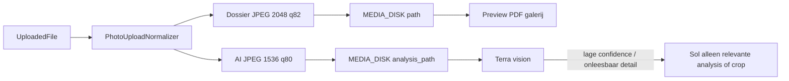

# Plan: Dossier- + AI-beeldvarianten per upload

> **Status:** done · **BL-030** · **Datum:** 2026-07-30 · Canonical item: [`docs/backlog.md` § BL-030](../backlog.md)

## Overview

Per foto-upload twee genormaliseerde varianten: dossier (~2048px) voor installateur/preview/PDF, en AI-analyse (~1536px) voor alle vision-calls. Geen telefoon-originelen op disk; Sol escaleert alleen met relevante analysekopieën.

## Beslissing (vast — geen open A/B)

Per foto-upload bewaren we **geen** volle telefoonresolutie (geen 4032×3024 op disk). We schrijven altijd twee private bestanden:

| Variant | Lange zijde | Formaat | Kwaliteit | Gebruik |
|---------|-------------|---------|-----------|---------|
| **Dossier** | **2048 px** | JPEG | **82** | Preview, galerij, HTML/PDF, installateur-zoom (meterkast/leidingdetail) |
| **AI-analyse** | **1536 px** | JPEG | **80** | Alleen vision-calls (Terra e.d.) |

Beide: auto-orient, EXIF/metadata strippen, HEIC/HEIF → JPEG. PNG/WebP-uploads worden voor opslag ook JPEG (één pad, minder edge-cases). Uploadlimiet (`INTAKE_UPLOAD_MAX_KB`) blijft gelden op het **binnenkomende** bestand vóór conversie.

**Waarom 2048 dossier (niet full phone, niet 1536):** genoeg om in te zoomen op groepen/aansluitingen/obstakels; geen posterdrukwerk; ~halve lineaire resolutie t.o.v. typische 4k-phone → veel minder storage zonder dossierkwaliteit te verliezen.

**Scope AI-consumenten (gedeelde bouwsteen):** alle vision-paden gebruiken de analysekopie — `AnalyzeRoutePhoto`, `SynthesizePipeRoute`-escalatie (Sol), `AssessFuseboxPhotos`, `DerivePhotoAnswers` en de latere BL-040/041-verbindingsanalyse. Lokale `AssessPhotoUsability` gebruikt **dossier** (zelfde beeld dat de mens ziet).

**Sol-escalatie:** stuurt opnieuw alleen de **relevante** segmentfoto’s als **analysekopie** (niet dossier, niet telefoon-origineeel). Synthese blijft tekst+segmentmetadata + die images.

**Latere optimalisatie, niet nodig voor afronding BL-030:** bij “detail onleesbaar” kan één hogere-res of crop van **die** foto (uit dossierbron, max ~2048 of gerichte crop) naar het model — nooit alle originelen opnieuw.

## Token-voorbeeld (richting, niet contract)

| Versie | Afmetingen | Geschat beeldgebruik |
|--------|------------|----------------------|
| Telefoon-origineeel (niet opslaan) | 4032 × 3024 | ±11.970 tokens |
| AI-kopie (wel naar Terra) | 1536 × 1152 | ±1.728 tokens |
| Besparing | | ±86% |

Vijf foto’s: ±60.000 → ±8.640 beeldtokens. Dossier op disk blijft ~2048 voor mensen; gaat niet naar het model tenzij fase-2 detail-escalatie.

## Opgeleverd

- [`PhotoUploadNormalizer`](../../app/Domains/Intake/Services/PhotoUploadNormalizer.php) zet JPEG/PNG/WebP/HEIC/HEIF altijd om naar twee georiënteerde, metadata-vrije JPEG's via Imagick of GD.
- Hoofd-, vervolg- en installateuruploads bewaren beide varianten met rollback-/retrycleanup; verwijderen en hard purge wissen beide.
- `AiImageResolver` is de enige gateway voor visionbytes. Nieuwe uploads gebruiken de analysevariant; historische records hebben een expliciet gelabelde dossierfallback.
- `AnalyzeRoutePhoto`, `DerivePhotoAnswers`, `AssessFuseboxPhotos`, dossiersynthese en de relevante Sol-routeherbeoordeling gebruiken de resolver.

## Architectuur



### Datamodel

Migratie op `intake_uploads`:

- `analysis_path` (nullable string) — pad AI-kopie; zelfde `disk`
- `analysis_mime_type` (nullable, default `image/jpeg`)
- `analysis_size_bytes` (nullable uint)
- `analysis_checksum` (nullable string)
- optioneel: `width` / `height` (dossierafmetingen) voor diagnostics

`path` / `mime_type` / `size_bytes` / `checksum` blijven de **dossier**-variant (UI/PDF ongewijzigd voor callers die `path` gebruiken).

### Code

1. **`PhotoUploadNormalizer`** — altijd Imagick-pipeline (niet alleen HEIC):
   - lees → `autoOrient` → `stripImage` → twee writes (dossier 2048/q82, analysis 1536/q80)
   - DTO [`NormalizedPhotoUpload`](../../app/Domains/Intake/Services/NormalizedPhotoUpload.php) uitbreiden met analysis temp-pad + meta + cleanupPaths voor beide temps
2. **`StoreIntakeUpload` / `StoreFollowUpUpload`** — beide bestanden op `MEDIA_DISK` (bijv. `…/{ulid}.jpg` + `…/{ulid}.analysis.jpg`); vul analysis-kolommen
3. **`AiImageResolver`** — `input(IntakeUpload): AiImageInput` (`analysis_path`; legacy dossierfallback); alle vision-actions hiernaartoe
4. **`HardDeleteIntake`** — ook `analysis_path` deleten
5. **Config** in [`config/intake.php`](../../config/intake.php):

```php
'conversion' => [
    'dossier_max_long_edge' => (int) env('INTAKE_DOSSIER_MAX_LONG_EDGE', 2048),
    'dossier_jpeg_quality' => (int) env('INTAKE_DOSSIER_JPEG_QUALITY', 82),
    'analysis_max_long_edge' => (int) env('INTAKE_ANALYSIS_MAX_LONG_EDGE', 1536),
    'analysis_jpeg_quality' => (int) env('INTAKE_ANALYSIS_JPEG_QUALITY', 80),
],
```

Verwijder/vervang oude `max_long_edge` / `heic_to_jpeg_quality` (één bron van waarheid; bump docs).

Een toekomstige detailcrop krijgt pas een eigen slice wanneer representatieve stagingbeelden aantonen dat 1536px onvoldoende is.

### Tests

- Normalizer: EXIF weg, lange zijde ≤2048/≤1536, beide JPEG, checksums verschillend
- Store: twee files op disk; HardDelete ruimt beide op
- AI actions (Fake/Http::fake): data-URL komt uit analysis-bytes (mock kleiner dan dossier)
- Legacy upload zonder `analysis_path`: resolver valt gecontroleerd terug op dossier

### Docs / backlog / changelog

- Nieuw **BL-030**: “Foto-varianten dossier + AI-analyse”
- Bijwerken: [`docs/uploads.md`](../uploads.md), [`docs/ai.md`](../ai.md) (tokens/Terra/Sol alleen analysis), korte verwijzing bij ADR-0012 / BL-040 indien route-escalatie geraakt wordt
- [`CHANGELOG.md`](../../CHANGELOG.md) `[Unreleased]`; documentversiebumps
- Env-voorbeelden: knobs documenteren; geen secrets

### Niet in scope

- Client-side resize vóór upload (server blijft source of truth)
- WebP als opslagformaat (JPEG vast)
- Backfill-job voor alle historische uploads (lazy op eerste AI-gebruik is genoeg)
- UI-wijzigingen behalve dat previews iets scherper/kleiner kunnen ogen (2048 i.p.v. 4k)

## Uitvolgorde

1. Config + migratie + DTO/normalizer (dossier+analysis)
2. Store + HardDelete + tests opslag
3. `AiImageResolver` + alle vision-actions omschakelen + tests
4. Docs + BL-030 + CHANGELOG
5. Relevante analysekopieën meesturen bij Sol-routeherbeoordeling

## Afrondingscheck

- [x] Config knobs (2048/82, 1536/80) + migratie `analysis_*` op `intake_uploads`
- [x] `PhotoUploadNormalizer`: altijd orient/strip/JPEG; schrijf dossier + analysis temps
- [x] Hoofd-, vervolg- en installateuruploads + verwijder-/purgepaden voor beide bestanden
- [x] `AiImageResolver` + alle vision-actions op `analysis_path`
- [x] Sol-routeherbeoordeling met alleen relevante analysekopieën
- [x] Pest + `uploads.md` / `ai.md` / CHANGELOG

Een detailcrop of hogere-res heranalyse blijft bewust buiten BL-030. Die krijgt alleen een
eigen backlog-slice wanneer representatieve stagingbeelden aantonen dat de analysevariant
onvoldoende detail bevat; nooit als generieke heranalyse van alle foto's.
