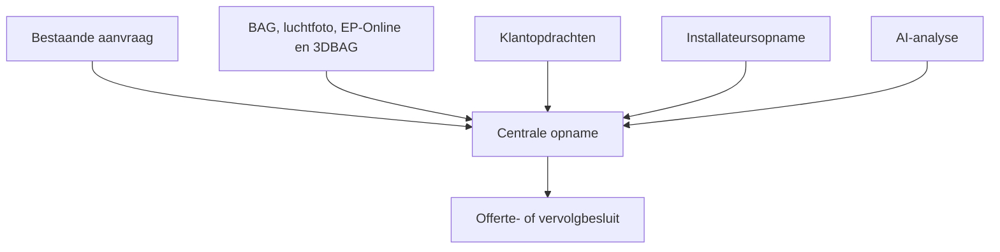

# Productmodel — centrale technische opname

> **Documentversie:** 1.0 · **Laatste update:** 2026-07-30 · Onderhoud: zie [AGENTS.md](../AGENTS.md)

Status: **besloten doelmodel; nog niet volledig geïmplementeerd**. De huidige vragenlijst-, upload-, open-data-, AI- en routefunctionaliteit blijft bestaan en wordt stapsgewijs onder dit model gebracht. De uitvoeringsvolgorde staat in [backlog.md](backlog.md).

## Doel en afbakening

De Digitale Opname start **nadat er al een aanvraag is gedaan**. Naam, contactgegevens, adres en de globale klantwens zijn dus al bekend of worden vanuit het bestaande aanvraagproces overgenomen.

Het product is geen leadformulier en geen kansscan. Het is de centrale technische werkplek waarmee een installatiebedrijf:

- zoveel mogelijk opnamewerk op afstand laat uitvoeren;
- de klant alleen om veilige, concrete waarnemingen vraagt;
- bestaande aanvraaggegevens en reeds gebouwde BAG-, PDOK-luchtfoto-, EP-Online- en 3DBAG-verrijking automatisch benut;
- AI gebruikt om bewijs te ordenen, ontbrekende informatie te kiezen en een technische voorzet te maken;
- met minimale beoordelingstijd beslist of een offerte op afstand mogelijk is;
- alleen een locatiebezoek plant wanneer beslissende onzekerheid niet veilig en redelijkerwijs op afstand kan worden opgelost.

Een opname kan ook volledig door de installateur op locatie worden uitgevoerd. Het dossiermodel staat los van wie de informatie aanlevert.

## De opname is het product

De vragenlijst is niet langer het centrale productmodel. De opname is het gezamenlijke technische dossier van één bestaande aanvraag.

De generieke relatie is:

`aanvraag → opname → ruimtes → plaatsingsopties → installatieopties → verbindingen → bewijs en onzekerheden → beslissing`

De intake-engine blijft een belangrijke invoerlaag voor vragen, foto-opdrachten, validatie en hervatten. Zij bepaalt niet langer welke technische objecten het dossier kan bevatten.

## Rollen

| Rol | Verantwoordelijkheid |
|-----|----------------------|
| Installateur | Is eigenaar van de opname, kan alles zelf vastleggen, corrigeert voorstellen en neemt het uiteindelijke technische en offertebesluit. |
| Klant | Levert alleen veilige waarnemingen en beelden via concrete, afgebakende opdrachten; kiest geen technisch systeem, definitieve unitpositie of route. |
| AI | Controleert beeldkwaliteit en dekking, legt sterke afleidingen vast, stelt plaatsingen/opstellingen/routes voor en kiest de nuttigste vervolgvraag. |
| Externe bron | Levert reeds bekende woning- en omgevingscontext met bron, datum en zekerheid. |
| Applicatie | Bewaart herkomst, zekerheid, tegenstrijdigheden, open punten en beslisstatus; zij voorkomt dubbele vragen en veld-voor-veld-bevestigingswerk. |

De installateur blijft eindverantwoordelijk. Dat betekent niet dat hij ieder automatisch vastgesteld veld apart moet bevestigen: zijn beoordeling van het gehele installatievoorstel en de gemarkeerde uitzonderingen geldt als akkoord.

## Drie volwaardige invoerworkflows

Bij het starten kiest de installateur hoe de opname wordt gevuld. Die keuze mag later wijzigen.

| Workflow | Start | Werkwijze | Klantlink |
|----------|-------|-----------|-----------|
| Klant voert uit | Installateur kiest **Klant laten opnemen** | Lineaire, eenvoudige opdrachten; AI begeleidt en vraagt alleen beslissende aanvullingen. | Direct aangemaakt en verzonden. |
| Installateur voert uit | Installateur kiest **Zelf de opname uitvoeren** | Mobiele, camera-first werkweergave; vrije volgorde; technische waarnemingen, posities en routes direct vastleggen. | Niet aangemaakt of verzonden. |
| Hybride | Eén van beide workflows is al gestart | Installateur vult zelf aan of stuurt later één of meer heel specifieke klantopdrachten. | Alleen aangemaakt of geactiveerd wanneer de klant werkelijk iets moet bijdragen. |

Alle drie vullen dezelfde ruimtes, plaatsingen, verbindingen, bewijzen, onzekerheden en beslissingen. Er ontstaan geen aparte klant- en installateursdossiers.

### Klantworkflow

1. De installateur start de opname vanuit een bestaande aanvraag.
2. Bekende aanvraaggegevens en de reeds gebouwde openbare-data-verrijking vullen het dossier.
3. De klant ontvangt:

   > **Met uw hulp kunnen we uw airco sneller plaatsen.**
   >
   > Wij halen bekende gegevens van uw woning zelf op. U laat ons met een paar gerichte foto's zien wat we niet op afstand kunnen weten. Zo kan de installateur vooraf bepalen wat nodig is en de plaatsing goed voorbereiden.

4. De klant krijgt steeds één concrete opdracht, bijvoorbeeld een kameroverzicht, buitenzijde of veilige foto van de meterkast.
5. De app controleert direct of het gevraagde zichtbaar is. Alleen ontbrekende, tegenstrijdige of beslissende informatie leidt tot een vervolgvraag.
6. De klant kan altijd **Niet veilig**, **Niet bereikbaar** of **Weet ik niet** kiezen. De app geeft nooit instructies om afdekkingen te verwijderen, uit een raam te hangen of elektrische controles uit te voeren.
7. Na de klanttaken bepaalt het dossier wat al op afstand kan worden beslist. Een afgeronde klanttaak betekent niet automatisch dat de technische opname beslisgereed is.

### Installateurworkflow

1. De installateur kiest bij de start **Zelf de opname uitvoeren**; er wordt geen klantlink verstuurd.
2. De aanvraaggegevens en automatische bronnen staan al in het dossier.
3. In een mobiele werkweergave kan de installateur vrij tussen ruimtes, buitenposities, meterkast en routes bewegen.
4. Hij kan foto's maken, maten vastleggen, posities aanwijzen en waarnemingen of conclusies direct als **ter plaatse vastgesteld** opslaan.
5. Een installateurswaarneming hoeft niet met een foto te worden bewezen wanneer de installateur haar zelf betrouwbaar heeft vastgesteld.
6. AI vult op de achtergrond aan, detecteert tegenstrijdigheden en toont alleen relevante open punten.
7. De installateur kan de opname in dezelfde werkgang afronden en het dossier als offerte- en werkvoorbereidingsbasis gebruiken.

### Hybride workflow

- Een installateur kan een klantopname op ieder moment zelf aanvullen.
- Een installateur kan zelf beginnen en later alleen een afgebakende klantopdracht sturen, bijvoorbeeld **Maak een leesbare foto van de meterkast**.
- Een klantlink toont uitsluitend de openstaande klanttaken, niet opnieuw de volledige intake.
- Na een klantbijdrage komt het dossier terug bij de installateur met de gewijzigde beslisstatus en alleen de relevante nieuwe uitzonderingen.

## Automatisch vaststellen, uitzonderingen beoordelen

Het systeem vraagt niet om losse bevestiging wanneer een gegeven met aan zekerheid grenzende waarschijnlijkheid is vastgesteld.

“Met aan zekerheid grenzende waarschijnlijkheid” is geen universeel modelpercentage en ook niet alleen een door AI gekozen label `high`. Per conclusie bepaalt een expliciete acceptatieregel welke bronkwaliteit, zichtbare evidence, onderlinge consistentie en veiligheidsimpact nodig zijn. Ontbreekt één van die voorwaarden, dan blijft het een voorstel of uitzondering.

| Bron | Standaardgedrag |
|------|-----------------|
| Bestaande aanvraag | Overnemen; alleen een conflict of ontbrekend beslissend gegeven tonen. |
| BAG / PDOK / EP-Online / 3DBAG | Automatisch als brongegeven opnemen; nooit een verplichte klantcontrole van overheidsvelden maken. |
| Klantfoto of -antwoord | Als waarneming aan het juiste dossierobject koppelen; bij voldoende bewijs mag een conclusie automatisch volgen. |
| Installateurswaarneming | Gezaghebbende menselijke waarneming, met actor, moment en eventueel locatiecontext. |
| AI-afleiding | Met model/prompt, bewijsreferenties en zekerheid opslaan; bij hoge zekerheid toepassen, bij relevante twijfel als uitzondering tonen. |

Voor alle automatisch verwerkte informatie gelden deze regels:

1. Herkomst, vaststellingsmoment en zekerheid blijven bewaard.
2. Een sterke conclusie wordt zonder extra bevestigingsscherm gebruikt.
3. Een gegeven blijft eenvoudig corrigeerbaar vanuit het dossier.
4. Alleen een tegenstrijdigheid, lage zekerheid of onzekerheid die oplossing, prijs, veiligheid of uitvoerbaarheid kan veranderen wordt voorgelegd.
5. Veiligheidskritische conclusies mogen technisch worden voorbereid, maar vallen onder de uiteindelijke goedkeuring van de installateur.
6. Niet ieder veld heeft een eigen akkoordstatus nodig; beoordeling gebeurt op installatievoorstel en uitzonderingen.

## Beslisgereedheid in plaats van één compleetheidspercentage

De bestaande vragenlijstcompleetheid blijft bruikbaar om te bepalen of een concrete taak is uitgevoerd. Zij mag niet langer worden gebruikt als synoniem voor een technisch complete opname.

Het dossier toont per beslisgebied:

| Beslisgebied | Voorbeeldstatus |
|--------------|-----------------|
| Aanvraag en gewenste ruimtes | genoeg informatie / ontbreekt |
| Capaciteit indiceren | genoeg / onzeker |
| Plaatsing en configuratie | kandidaat gereed / keuze nodig |
| Koelleiding(en) | aannemelijk / aanvulling nodig / op afstand niet vast te stellen |
| Condensafvoer | aannemelijk / risico / ontbreekt |
| Stroomtoevoer | aannemelijk / installateurscontrole / ontbreekt |
| Kostenbepalende risico's | in beeld / open |
| Offertebesluit | op afstand mogelijk / alleen prijsindicatie / aanvulling / locatiebezoek |

De mogelijke volgende beslissingen zijn:

- **Offerte op afstand voorbereiden**
- **Prijsindicatie sturen; technische controle volgt**
- **Gerichte aanvulling vragen**
- **Locatiebezoek plannen**
- **Technisch niet passend / aanvraag afwijzen**

Een onbekend gegeven is een geldige uitkomst. Het dossier moet dan tonen welke beslissing daardoor nog niet kan worden genomen en waarom verder digitaal verzamelen wel of geen zin heeft.

## Airco-domeinmodel

### Ruimtes zijn geen units

De aanvraag benoemt gewenste ruimtes, bijvoorbeeld twee slaapkamers. Dat betekent nog niet automatisch twee binnenunits of één specifieke buitenunitconfiguratie.

Per gewenste ruimte bewaart de opname:

- ruimte-identiteit en gebruik;
- relevante omstandigheden voor capaciteit;
- bewijs en waarnemingen;
- nul, één of meer kandidaatposities voor een binnenunit.

### Plaatsings- en installatieopties

Een **plaatsingsoptie** is een mogelijke positie voor een binnenunit, buitenunit, voedingspunt of afvoerpunt. Zij is nog geen definitieve keuze.

Een **installatieoptie** combineert:

- één of meer binnenunitposities;
- één of meer buitenunitposities;
- de voorgenomen koppeling tussen die posities;
- bijvoorbeeld single-split, multi-split of meerdere single-splits;
- per technische verbinding het bewijs, de onzekerheid en de kostenimpact.

AI mag opties voorstellen en rangschikken. De installateur kiest, corrigeert of verwerpt.

### Drie volwaardige technische verbindingen

Iedere relevante installatieoptie onderzoekt afzonderlijk:

| Verbinding | Van → naar | Minimaal vast te leggen |
|------------|------------|--------------------------|
| Koelleiding | Binnenunit → gekoppelde buitenunit | Waarschijnlijke route, lengteklasse, doorvoeren, obstakels, afwerking, bereikbaarheid en bewijs per segment. |
| Condensafvoer | Iedere binnenunit → geschikt lozingspunt | Verval/pomprisico, route, lozingspunt, zichtbaarheid, obstakels en onzekerheden. |
| Stroomtoevoer | Geschikte voedingsbron → vereist aansluitpunt van het gekozen systeem | Meterkast/groep, bestaande of nieuwe voeding, kabelroute, binnen- of buitenaansluiting, bereikbaarheid en verplichte vakcontrole. |

Stroomtoevoer is dus niet alleen een meterkastfoto. Ook de kabelroute naar het juiste aansluitpunt is onderdeel van de offertebasis.

Verbindingen bestaan uit segmenten. Foto's, kaartbeelden, antwoorden, metingen, installateurswaarnemingen en AI-analyses kunnen bewijs zijn voor één segment of voor de gehele verbinding.

## Voorbeeld: twee airco's voor slaapkamers

1. De aanvraag **airco voor twee slaapkamers** bestaat al.
2. De installateur kiest klantopname of zelf uitvoeren.
3. BAG, luchtfoto, EP-Online en 3DBAG worden met hun bestaande implementatie automatisch aan de opname toegevoegd.
4. De twee slaapkamers worden als gewenste ruimtes vastgelegd; nog niet als definitief aantal binnen- of buitenunits.
5. Via klantfoto's of installateurswaarnemingen ontstaan kandidaatposities binnen en buiten.
6. De app vormt bijvoorbeeld twee opties: één multi-split of twee single-splits.
7. Voor iedere optie worden koelleidingen, condensafvoer en stroomtoevoer onderzocht.
8. Alleen het ontbrekende stuk dat de keuze of prijs kan veranderen wordt als concrete taak gevraagd.
9. AI levert een installatievoorstel met bewijs, zekerheid, kostenrisico's en open punten.
10. De installateur beoordeelt het geheel en kiest: op afstand offreren, nog één aanvulling of een locatiebezoek.

## Huidige implementatie naar doelmodel

| Huidige bouwsteen | Behouden rol in het doelmodel |
|-------------------|-------------------------------|
| `intakes` | Blijft voorlopig de technische opname en migratieanker. |
| Template → sectie → vraag → antwoord | Vragen- en takenkanaal waarmee bewijs en waarnemingen worden verzameld. |
| `intake_external_facts` | Bestaande automatische dossierbron voor BAG, luchtfoto, EP-Online, 3DBAG en afleidingen. |
| `intake_uploads` | Private mediabron; krijgt doelobject-/bewijsrelaties naast de huidige vraagkoppeling. |
| `intake_follow_up_*` | Voorloper van afgebakende bijdrageopdrachten; wordt inzetbaar vóór én na klantafronding en voor hybride werk. |
| `pipe_route_sessions` / `segments` | Herbruikbare analysebouwsteen; wordt gekoppeld aan één concrete koelleiding, condensroute of stroomroute binnen een installatieoptie. |
| `intake_reviews` | Voorloper van beslisgereedheid en volgende acties; één algemene boolean is niet genoeg voor het doelmodel. |
| `CompletenessChecker` | Blijft de poort voor voltooiing van een concrete taakset, niet voor technische beslisgereedheid. |
| AI-samenvatting en aandachtspunten | Worden uitgebreid naar evidence-synthese, kandidaatopstellingen, gerichte taken en uitzonderingsbeoordeling. |

## Productinvarianten

1. Er bestaat al een aanvraag voordat de technische opname start.
2. De opname is van de installateur; een klantlink is optioneel.
3. Klant, installateur, AI en externe bronnen vullen hetzelfde dossier.
4. De klant krijgt geen technische ontwerpverantwoordelijkheid.
5. De installateur kan de opname volledig zelf en in vrije volgorde uitvoeren.
6. Bekende of zeer zekere gegevens worden niet veld voor veld bevestigd.
7. Iedere conclusie is herleidbaar tot bewijs en actor/bron.
8. Koelleiding, condensafvoer en stroomtoevoer zijn afzonderlijke verbindingen.
9. Een klanttaak kan compleet zijn terwijl het dossier nog niet beslisgereed is.
10. Een locatiebezoek is een bewuste uitkomst nadat relevante digitale mogelijkheden zijn benut, geen automatische fallback bij de eerste onzekerheid.
11. AI- of providerfalen blokkeert vastlegging, dossiergebruik of handmatige beoordeling nooit.
12. Nieuwe invoerworkflows mogen geen tweede waarheid naast het dossier creëren.

## Buiten scope van dit doelmodel

- leadgeneratie of kwalificatie vóór een bestaande aanvraag;
- de klant zelf een definitief systeem, vermogen, unitpositie of technisch tracé laten kiezen;
- AI zelfstandig een veiligheidskritische installatie laten goedkeuren;
- onveilige foto- of elektrische instructies;
- het huidige schema in documentatie als al gemigreerd presenteren voordat de bijbehorende migraties zijn gebouwd.

Architectuurbesluiten: [ADR-0011](decisions/0011-central-survey-dossier-and-contributors.md) en [ADR-0012](decisions/0012-airco-installation-options-and-connections.md).
